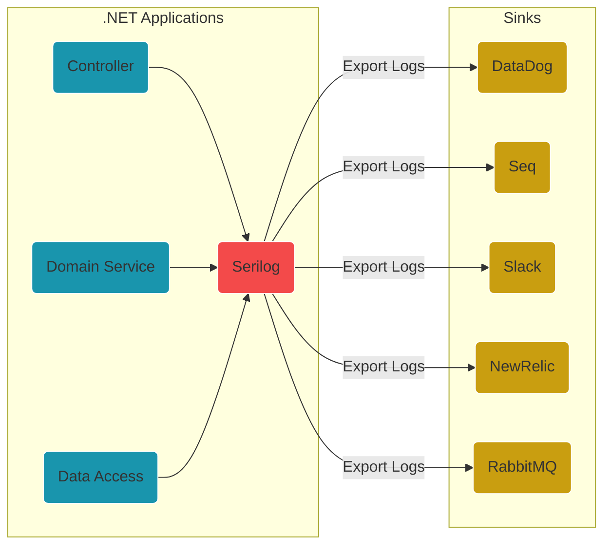

# Loggin & Datadog with .NET 6

---
## What is DataDog?
>Datadog is a monitoring and analytics tool that can be used to determine performance metrics as well as event monitoring for infrastructure and cloud services. 
---
## What is Serilog?
>Serilog is a logging library that supports of _structured logging_, which allows logs to be treated as data sets rather than text. 
---
## Flow diagram

---
## Open-Source Alternatives:
* Zipkin
* Jaeger
* Signoz
---
## Links:
* [Serilog: Getting Started](https://github.com/serilog/serilog/wiki/Getting-Started)
* [Serilog: Configuration Basics](https://github.com/serilog/serilog/wiki/Configuration-Basics)
* [List of Serilog Sinks](https://github.com/serilog/serilog/wiki/Provided-Sinks)
* [Datadog Integration with .NET](https://docs.datadoghq.com/integrations/dotnet/)
* [DataDog/serilog-sinks-datadog-logs](https://github.com/DataDog/serilog-sinks-datadog-logs)
* [Datalust/serilog-sinks-seq](https://github.com/datalust/serilog-sinks-seq)

